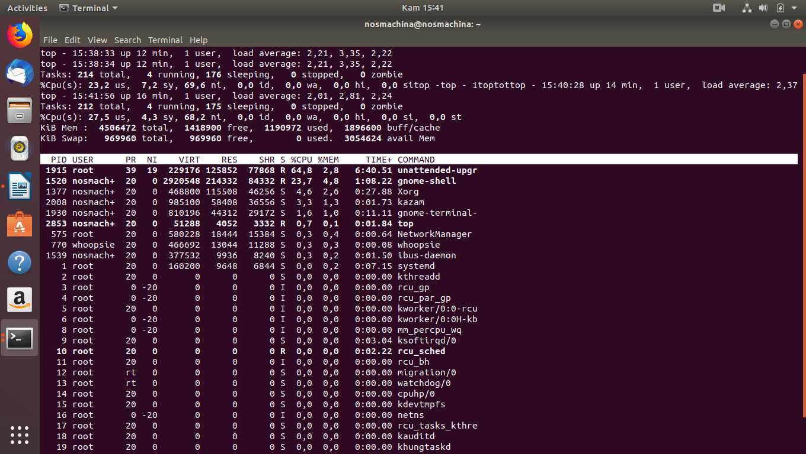
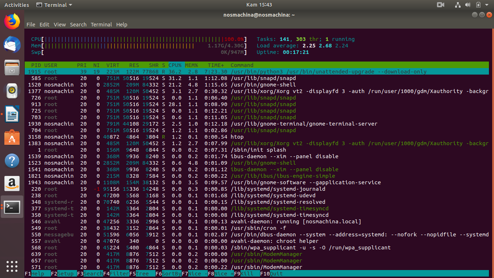
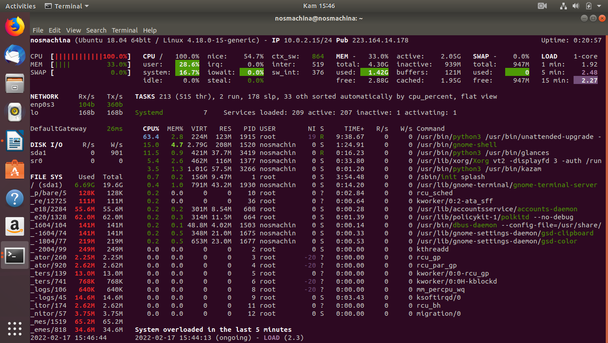

# Praktik Memonitor Proses

## Process Monitoring

Pada bagian pengenalan proses di kuliah kedua disebutkan bahwa satu aplikasi dapat menciptakan _N-_buah proses. Untuk mengetahui berapa banyak proses yang diciptakan oleh sebuah aplikasi, diperlukan perangkat lunak untuk memonitor kegiatan tersebut.&#x20;

Pada praktik kali ini, penulis akan menggunakan sistem operasi linux berbasis debian yang dapat diunduh pada [situs resmi ubuntu](https://ubuntu.com).

Perangkat lunak yang umumnya digunakan untuk melakukan _process monitoring_ adalah top, htop, dan glances.&#x20;

### Mengunduh perangkat lunak yang dibutuhkan

Untuk mengunduh perangkat lunak yang dibutuhkan, pembaca dapat menggunakan APT (_Advanced Package Tool_) yang disediakan oleh debian.&#x20;

Buka terminal dan ketikkan:

```
sudo apt-get install top htop glances -y --fix-missing
```

Perintah tersebut berfungsi untuk mengunduh perangkat lunak yang bernama top, htop, dan glances.

> Gunakan perintah `--fix-missing` jika terdapat _package_ yang mungkin hilang karena suatu kesalahan.

### Menggunakan Top

Ketikkan perintah ini ke terminal untuk menggunakan perangkat lunak _top_:

```
top
```

Hasil dari perintah tersebut akan terlihat seperti ini:



Gambar diatas menunjukkan beberapa proses yang sedang berjalan pada komputer. Perangkat lunak _top_ hanya menunjukkan proses yang berjalan dengan tampilan yang paling sederhana.&#x20;

### Menggunakan Htop

Jika pembaca ingin untuk mendapatkan informasi yang lebih mendetail mengenai proses yang sedang berjalan, maka ia dapat menggunakan perangkat lunak _htop._

Untuk menggunakan perangkat lunak _htop,_ ketikkan perintah ini pada terminal:

```
htop
```

Hasil dari perintah tersebut akan terlihat seperti ini:



Gambar diatas memperlihatkan bahwa perangkat lunak _htop_ memiliki tampilan yang lebih mendetail serta ramah pengguna (_user-friendly_). Pengguna dapat dengan mudah melihat persentase penggunaan CPU, RAM, dan Swap pada perangkat lunak _htop_.&#x20;

### Menggunakan Glances

Terdapat perangkat lunak yang mampu memperlihatkan berbagai proses yang sedang berjalan dengan lebih detail dibandingkan dengan _htop_. Perangkat lunak tersebut glances.&#x20;

Yang membuat glances berbeda dibandingkan _top_ dan _htop_ adalah selain terdapat fitur untuk memonitor penggunaan CPU, RAM serta proses yang sedang terjadi didalam suatu komputer, terdapat juga fitur untuk melihat kondisi jaringan, virtual machine yang berjalan di _cloud_, serta docker container yang sedang berjalan.&#x20;

Untuk menggunakan glances, ketikkan perintah ini pada terminal:

```
glances
```

Hasil dari perintah tersebut akan terlihat seperti ini:



Keuntungan dari menggunakan glances adalah perangkat lunak ini ditulis menggunakan bahasa pemrograman Python, berbeda dengan _top_ dan _htop_ yang menggunakan bahasa pemrograman c. Dengan menggunakan bahasa pemrograman python, glances dapat dijalankan di berbagai sistem operasi, termasuk Windows.&#x20;
