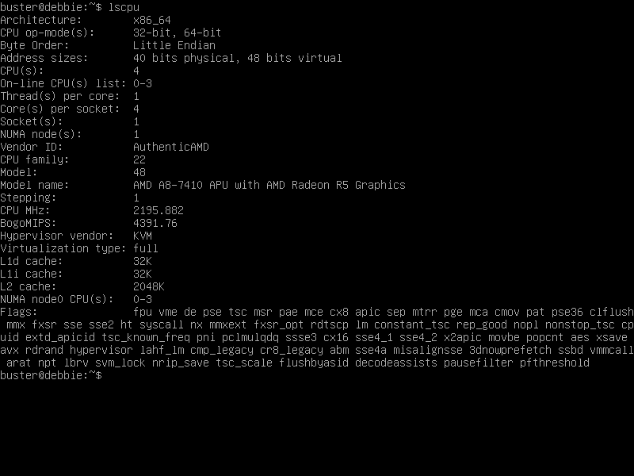
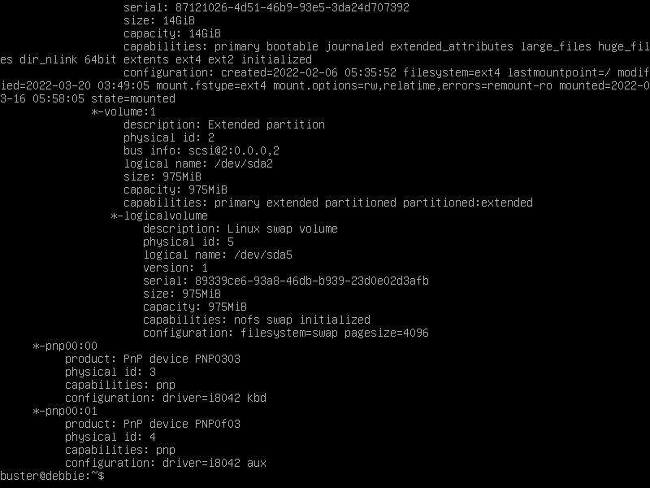
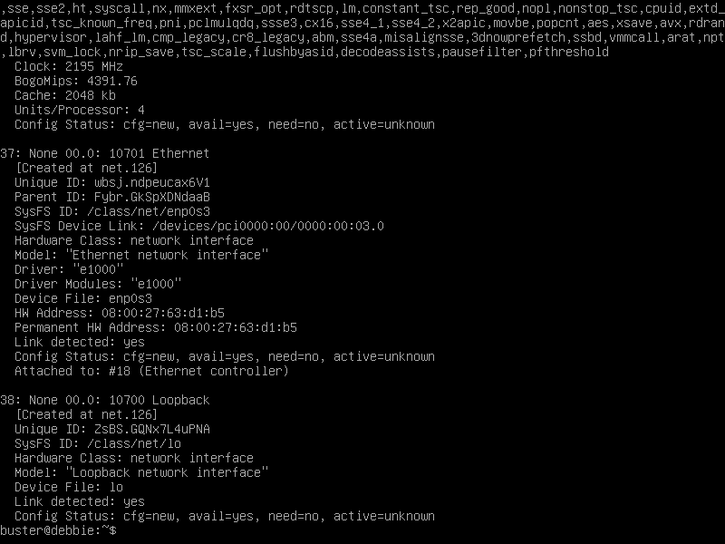
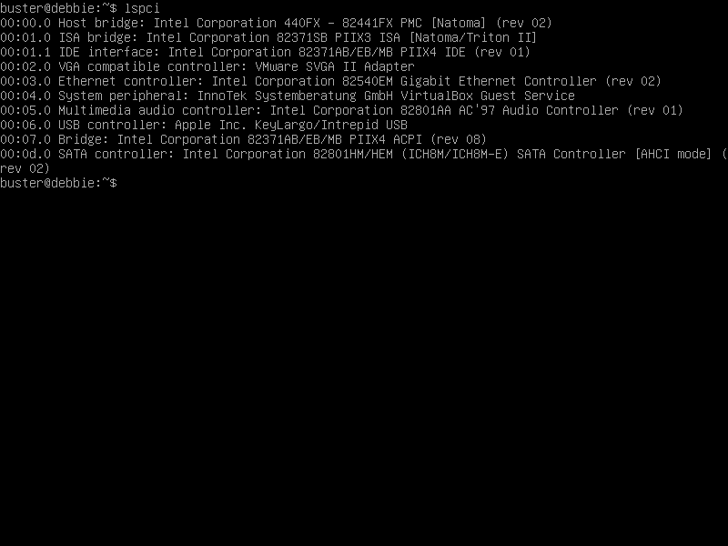
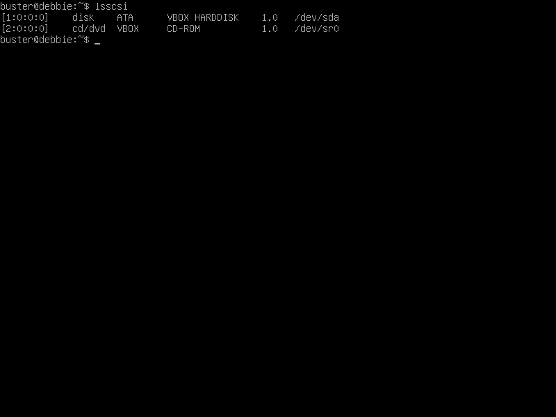
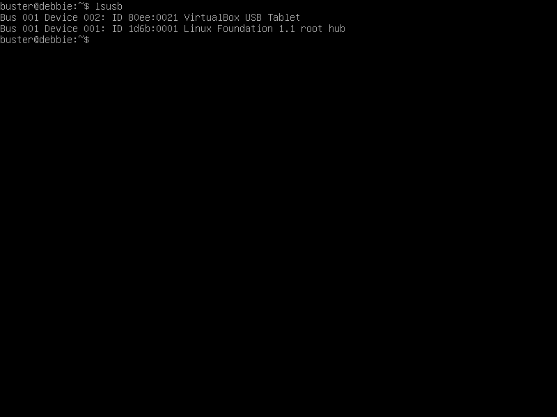
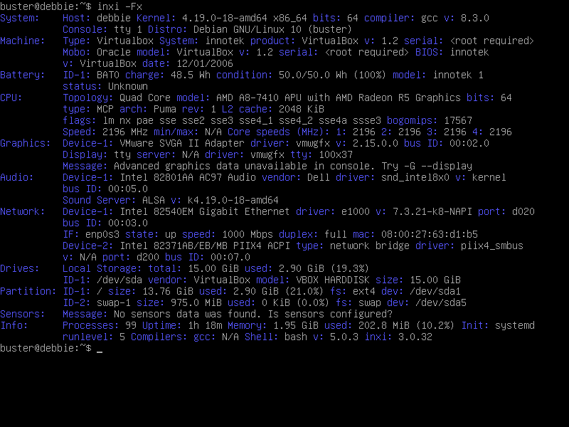
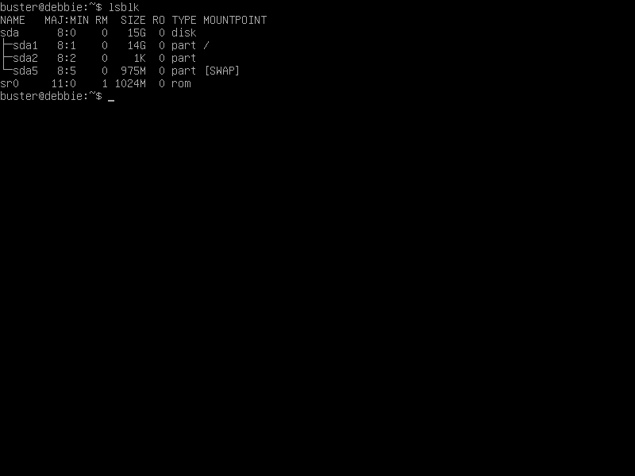

# Praktik Menjalankan Utilitas Kernel

Untuk dapat memahami kemampuan sistem secara lebih mendetail, administrator sistem harus mengetahui beberapa utilitas penting yang terdapat dalam sistem operasi linux. Beberapa utilitas ini akan membantu untuk mengetahui secara mendalam mengenai perangkat keras yang terpasang, partisi pada sistem, sisa penyimpanan, dll.

### lscpu

Program utilitas `lscpu` berfungsi untuk memberikan informasi mengenai arsitektur dari CPU yang terpasang dalam sistem. Informasi yang ditampilkan pada program ini diantaranya jumlah CPU, nilai _thread_, ordo _byte_, model CPU, dan beberapa informasi lainnya.&#x20;

Untuk menjalankan program ini, pengguna dapat mengetikkan perintah ini pada terminal:

```
lscpu
```

Hasil dari perintah tersebut dapat dilihat pada gambar dibawah:



### lshw

`lshw` merupakan sebuah program utilitas yang berfungsi untuk menampilkan informasi lengkap mengenai konfigurasi perangkat keras pada sistem. Informasi yang ditampilkan diantaranya konfigurasi memori, versi _firmware_, konfigurasi _mainboard_, versi CPU, dll.

Untuk menjalankan program, ketikkan perintah ini pada terminal:

```
sudo lshw
```

> Perintah ini sebaiknya dijalankan dengan akses _superuser_ agar menghasilkan keluaran sesuai dengan kondisi sistem yang sebenarnya

Hasil dari perintah tersebut dapat dilihat pada gambar dibawah ini:



Pada umumnya, keluaran dari program utilitas `lshw` akan sangat banyak sehingga sulit untuk dapat dibaca dengan cepat. Untuk mendapatkan informasi perangkat keras secara ringkas, gunakan _flag_ `-short`. Untuk menjalankan perintah tersebut, ketikkan ini pada terminal:

```
sudo lshw -short
```

Hasil dari perintah tersebut akan terlihat seperti gambar dibawah:


### hwinfo

Program utilitas `hwinfo` merupakan sebuah program yang mampu memberikan informasi mengenai komponen perangkat keras seperti RAM, USB _devices,_ kartu grafis, dll. Utilitas ini memberikan keluaran yang hampir sama dengan `lshw` hanya saja dalam format yang berbeda.

Untuk menjalankan utilitas `hwinfo`, ketikkan perintah ini pada terminal:

```
sudo hwinfo
```

Hasil dari perintah diatas akan terlihat seperti ini:



### lspci

Program utilitas `lspci` berfungsi untuk menunjukkan informasi mengenai perangkat PCI dan PCIe yang terhubung pada sistem.&#x20;

Untuk dapat menjalankan program utilitas `lspci`, ketikkan perintah ini pada terminal:

```
lspci
```

Hasil dari perintah tersebut akan terlihat seperti gambar dibawah:



### lsscsi

Program utilitas `lsscsi` bertujuan untuk menampilkan semua perangkat SCSI yang terhubung pada sistem. Umumnya, perangkat SCSI yang ditemukan pada sistem berupa media penyimpanan seperti CD/ROM, HDD, maupun SSD.

Untuk dapat menggunakan utilitas `lsscsi`, ketikkan perintah ini pada terminal:

```
lsscsi
```

Keluaran dari perintah tersebut dapat dilihat pada gambar dibawah:



### lsusb

Program utilitas `lsusb` merupakan sebuah program yang berfungsi untuk menampilkan informasi mengenai _device_ yang terhubung melalui USB hub.&#x20;

Untuk dapat menggunakan program `lsusb`, ketikkan perintah ini ke terminal:

```
lsusb
```

Perintah tersebut akan menghasilkan keluaran seperti ini:



### inxi

`inxi` merupakan sebuah program yang bertujuan untuk menampilkan informasi sistem yang umumnya digunakan untuk menjelaskan kondisi sistem kepada forum _technical support_ apabila terjadi suatu permasalahan.&#x20;

Untuk menggunakan program `inxi`, ketikkan perintah ini pada terminal:

```
inxi -Fx
```

> _flag_ -Fx disematkan pada perintah `inxi` untuk menampilkan informasi keseluruhan mengenai sistem.

Hasil dari perintah tersebut dapat dilihat pada gambar dibawah:



### lsblk

Program utilitas `lsblk` merupakan sebuah program yang berfungsi untuk menampilkan informasi mengenai _block devices_ yang tersedia dalam sistem.&#x20;

Untuk menjalankan program `lsblk`, ketikkan perintah ini pada terminal:

```
lsblk
```

Hasil dari perintah tersebut dapat dilihat pada gambar dibawah:



### df

`df` merupakan sebuah program utilitas yang berfungsi untuk menampilkan informasi mengenai jumlah penyimpanan yang telah terpakai maupun yang masih tersedia.

Untuk menggunakan program `df`, ketikkan perintah ini pada terminal:&#x20;

```
df -H
```

> _Flag_ -H digunakan untuk menampilkan informasi jumlah penyimpanan dengan satuan G (Giga)&#x20;

Hasil dari perintah diatas dapat dilihat pada gambar dibawah ini:


### fdisk

`fdisk` merupakan sebuah utilitas yang bertujuan untuk memanipulasi partisi. _Block devices_ (dapat dilihat menggunakan `lsblk`) dapat dibagi menjadi satu atau lebih _logical disk_ yang dinamakan partisi.&#x20;

Untuk dapat melihat partisi yang berada dalam sistem, pengguna dapat menjalankan perintah ini pada terminal:

```
sudo fdisk -l
```

> _Flag_ -l pada perintah fdisk berfungsi untuk menampilkan _list_ dari partisi yang berada dalam sistem.
>
>

Hasil dari perintah tersebut akan terlihat seperti gambar dibawah ini:&#x20;


### free

`free` merupakan sebuah program utilitas yang berfungsi untuk menampilkan informasi mengenai memori _physical_ dan _swap_ yang tersedia.&#x20;

Untuk menggunakan program `free`, ketikkan perintah ini pada terminal:

```
free -m
```

> _Flag_ -m digunakan untuk menampilkan informasi dalam satuan m (_mebibytes_)

Hasil dari perintah tersebut dapat dilihat pada gambar dibawah:


### /proc/version

`/proc/version` merupakan sebuah file yang menyimpan informasi mengenai versi linux yang berada pada sistem.&#x20;

Untuk melihat file ini, ketikkan perintah dibawah:

```
cat /proc/version
```

Hasil dari perintah tersebut dapat dilihat pada gambar dibawah:


### uname

`uname` merupakan program utilitas yang berfungsi untuk menampilkan informasi sistem.

Untuk menggunakan program ini, ketikkan perintah ini pada terminal:

```
uname -a
```

> _Flag_ -a pada perintah `uname` berfungsi untuk menampilkan semua informasi sistem.

Hasil dari perintah tersebut dapat dilihat pada gambar dibawah:


### /proc/partitions

`/proc/partitions` merupakan sebuah _file_ yang menyimpan informasi mengenai partisi yang berada dalam sistem.&#x20;

Untuk melihat _file_ tersebut, ketikkan perintah ini pada terminal:

```
cat /proc/partitions
```

Hasil dari perintah tersebut dapat dilihat pada gambar dibawah ini:


