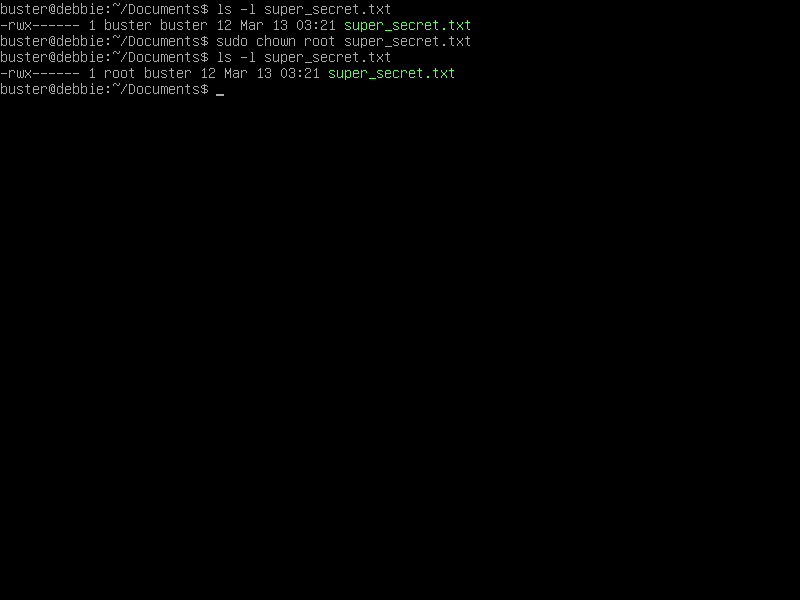

# Hak Akses & Hak Milik

### <mark style="color:blue;">Informasi Penulis</mark>

<mark style="color:blue;">Disusun oleh: I Gusti Ngurah Agung Krisna Adhitya</mark>&#x20;

<mark style="color:blue;">NIM: 2005551072</mark>

<mark style="color:blue;">Mata Kuliah: Network Operating System (NOS)</mark>

<mark style="color:blue;">Dosen Pengampu: I Putu Agus Eka Pratama ST., MT.</mark>

<mark style="color:blue;">Jurusan Teknologi Informasi, Fakultas Teknik, Universitas Udayana</mark>

## Hak Akses (Privilege)

Linux merupakan sebuah sistem operasi multi-pengguna (_multi user_). Karena setiap pengguna dapat menyimpan _file_ milik mereka masing-masing dalam satu sistem operasi, diperlukan sebuah fitur yang mampu mengatur hak akses mereka atas suatu _file._ Dengan memiliki fitur ini, pemilik _file_ dapat memastikan bahwa _file_ tersebut hanya dapat diakses oleh orang yang telah diizinkan saja.&#x20;

Dalam sistem operasi linux, pemilik _file_ dapat mengatur hak akses terhadap tiga kelas pengguna, diantaranya:&#x20;

1. Pemilik _file._
2. Pengguna yang berada dalam _group_ yang sama.
3. Pengguna lainnya.

Tipe akses yang mampu diterapkan kedalam sebuah _file_ antara lain:

1. Akses baca (_read_)
2. Akses tulis (_write_)
3. Akses eksekusi (_execute_)

Untuk dapat melihat hak akses dari suatu file, gunakan perintah `ls -l [nama-file]`. Perintah tersebut akan menghasilkan keluaran seperti gambar dibawah ini:


Keluaran tersebut dapat diklasifikan menjadi lebih detail seperti ini:&#x20;

```
-rwx------  1 buster buster 12 Mar 13 03:21 super_secret.txt
|[-][-][-]-   [----] [----]
| |  |  |       |       |
| |  |  |       |       +------------> 6. Group
| |  |  |       +--------------------> 5. Pemilik file
| |  |  | 
| |  |  +----------------------------> 4. Hak Akses Pengguna Lainnya
| |  +-------------------------------> 3. Hak Akses Group
| +----------------------------------> 2. Hak Akses Pemilik
+------------------------------------> 1. Tipe File
```

Penjelasan dari komponen diatas:

1. Tipe File: Menandakan jenis dari _tersebut_, untuk _file_ biasa, maka notasinya adalah `-`, _directory_ memiliki notasi `d` dan _symbolic link_ memiliki notasi `l`.&#x20;
2. Hak Akses Pemilik: Triplet karakter pertama mendandakan hak akses _file_ yang dimiliki oleh pemilik _file_ tersebut. Pada contoh kali ini, pemilik _file_ memiliki hak akses _file_ penuh, yang terdiri dari `r` (akses baca), `w` (akses tulis), dan `x` (akses eksekusi).
3. Hak Akses Group: Triplet karakter kedua menandakan hak akses _file_ yang dimiliki oleh pengguna lainnya yang berada dalam _group_ yang sama. Pada contoh ini, tidak ada hak akses yang diberikan pada pengguna tersebut.
4. Hak Akses Pengguna Lainnya: Triplet karakter terakhir menandakan hak akses _file_ yang dimiliki oleh pengguna lainnya yang bukan pemilik _file_ serta pengguna lainnya yang berada dalam _group_ yang sama dengan pemilik _file_ tersebut. Pada contoh ini, tidak ada hak akses yang diberikan pada pengguna lainnya.
5. Pemilik File: Menunjukkan nama pemilik dari _file_ tersebut.
6. Group: Menunjukkan nama _group_ dari pemilik _file_ tersebut.

> Triplet karakter merupakan gabungan dari tiga karakter yang merepresentasikan hak akses -- sebagai contoh "rwx".

### Mengatur Hak Akses

Kemampuan untuk mengganti hak akses dari _file_ yang diinginkan merupakan hal yang esensial untuk dilakukan sebagai administrator sistem maupun pengguna umum. Diperlukan pemahaman mengenai logika representasi nilai `r`, `w`, dan `x` secara desimal. Representasi desimal dari `r` (akses baca) adalah 4, representasi desimal dari `w` (akses tulis) adalah 2, dan representasi desimal dari nilai `x` (akses eksekusi) adalah 1. Representasi desimal ini diambil dari notasi biner yang dibawa oleh ketiga karakter hak akses, gambar dibawah akan menjelaskan lebih lanjut mengenai hal tersebut.


Dengan mengetahui logika diatas, mengubah hak akses terhadap suatu _file_ dapat dilakukan secara terstruktur. Sebagai contoh, apabila seorang administrator sistem ingin mengubah hak akses baca, tulis, dan eksekusi suatu _file_ menjadi dibatasi kepada pemilik _file_ tersebut, maka ia dapat mengatur hak akses yang sesuai melalui perintah `chmod` diikuti dengan notasi desimalnya.&#x20;

```
sudo chmod 700 super_secret.txt
```

Alasan dari nilai "`700`" dapat dijelaskan sebagai berikut:&#x20;

1. Pemilik memiliki hak akses penuh (`rwx`), sehingga nilai desimalnya adalah 4 + 2 + 1 = 7.
2. Pengguna _group_ tidak memiliki akses apapun, sehingga nilai desimalnya adalah 0.
3. Pengguna lainnya tidak memiliki akses apapun, sehingga nilai desimalnya adalah 0.

## Hak Milik

Selain hak akses, setiap _file_ dalam sistem operasi linux juga memiliki hak milik. Untuk dapat melihat pemilik dari suatu _file_, pengguna dapat menggunakan perintah `ls -l [nama-file]`. Pada gambar 1, terlihat bahwa pemilik _file "_super\_secret.txt" adalah seorang pengguna yang bernama "buster". Untuk dapat mengubah kepemilikan suatu _file_, maka perintah yang dapat digunakan adalah `chown`. Sintaks perintah `chown` adalah:

```
chown [pengguna] [nama_file]
```

Untuk mengubah kepemilikan _file_ "super\_secret.txt" dari pengguna "buster" ke "root", maka pengguna perlu mengetikkan perintah ini:

```
sudo chown root super_secret.txt
```

Hasil dari perintah tersebut dapat dilihat pada gambar dibawah ini:&#x20;



Dapat diamati dari gambar diatas bahwa kepemilikan _file_ "super\_secret.txt" kini menjadi milik pengguna "root". Karena hak akses dari _file_ tersebut hanya mengizinkan pemilik _file_ untuk memiliki akses penuh, seharusnya pengguna biasa tidak dapat melihat isi dari _file_ tersebut. Apabila pengguna biasa ingin membaca _file_ tersebut, hasilnya akan terlihat menjadi seperti ini:


Cara untuk dapat mengatur hak akses ke pengguna lainnya akan didemonstrasikan pada materi selanjutnya.
