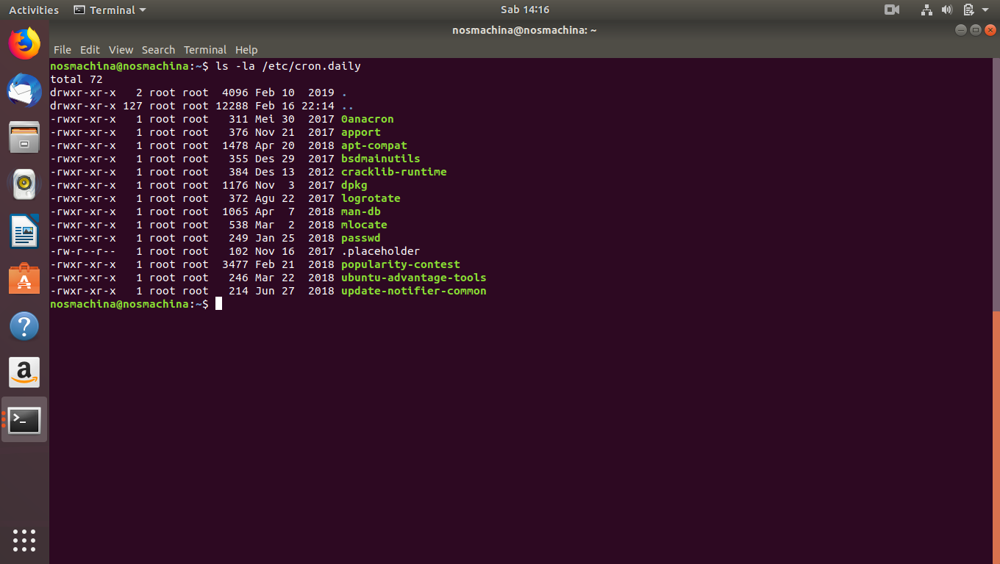
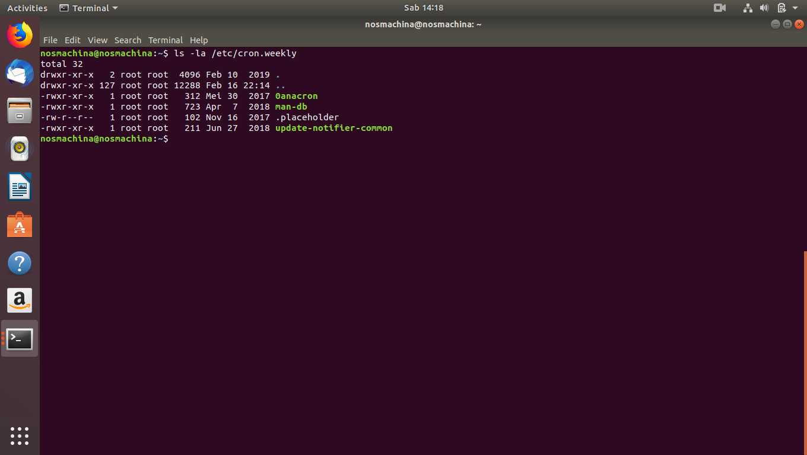
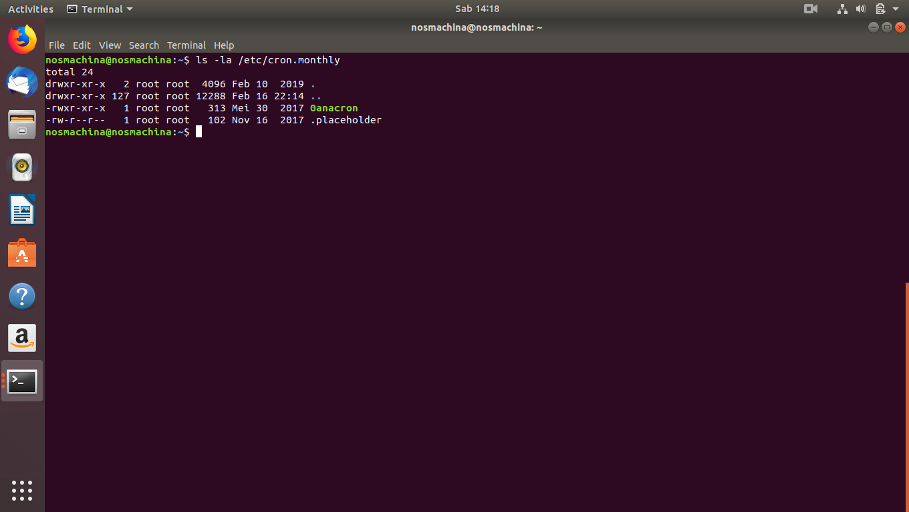

# Praktik Mengecek Schedule

## Mengecek Schedule dalam Linux

Pada sistem operasi Linux, pengguna dapat mengecek _schedule_ yang berada dalam sistem mereka dengan menggunakan cron.

Schedule yang dapat dicek oleh melalui cron diantaranya, jadwal harian (_daily_), jadwal mingguan (_weekly_), dan jadwal bulanan (_monthly_).

#### Cron Daily

Untuk mengecek jadwal harian, pengguna dapat mengetikkan perintah ini kedalam terminal:

```
ls -la /etc/cron.daily
```

Hasil dari perintah ini dapat dilihat pada gambar dibawah:



#### Cron Weekly

Untuk mengecek jadwal mingguan, pengguna dapat mengetikkan perintah ini kedalam terminal:

```
ls -la /etc/cron.weekly
```

Hasil dari perintah ini dapat dilihat pada gambar dibawah:



#### Cron Monthly

Untuk mengecek jadwal bulanan, pengguna dapat mengetikkan perintah ini kedalam terminal

```
ls -la /etc/cron.monthly
```

Hasil dari perintah ini dapat dilihat pada gambar dibawah:


