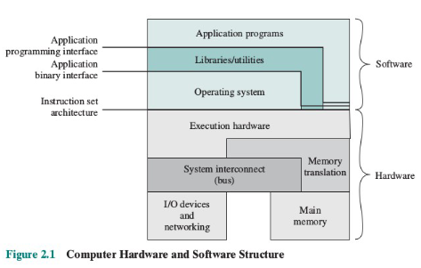

# Struktur Letak OS

## Abstraksi Letak OS antara user dan hardware

_Operating System_ terletak diantara pengguna dan perangkat keras komputer yang berfungsi sebagai antar muka (_interface_) diantara pengguna dan perangkat keras yang diperlukan untuk menjalankan berbagai aplikasi yang diinginkan. Ilustrasi dibawah merupakan abstraksi tingkat tinggi mengenai gambaran konseptual tentang hubungan antara pengguna dan perangkat keras.&#x20;

.png>)

Karena _Operating System_ bertugas untuk menginstruksikan perangkat keras dalam menjalankan berbagai tugas, maka diperlukan sebuah mekanisme untuk memastikan bahwa _operating system_ dapat menggunakan perangkat keras secara efisien. Mekanisme tersebut dinamakan **driver**. Dengan menggunakan _driver_, perangkat lunak tidak perlu untuk mengetahui secara detail bagaimana cara untuk mengoperasikan suatu perangkat keras.&#x20;

## Letak OS dalam software dan hardware stack

Untuk mendapatkan gambaran lebih jelas mengenai letak _Operating System_ diantara perangkat lunak dan perangkat keras, struktur stack dapat membantu menggambarkan hubungan tersebut secara lebih jelas.&#x20;

### Application Programs

Terlihat pada diagram tersebut bahwa program aplikasi terletak pada posisi yang paling tinggi, kedudukan ini berarti pengguna berinteraksi secara langsung dengan aplikasi yang dijalankan pada suatu komputer.&#x20;

Terdapat _Application Programming Interface_ (API) yang menjadi jembatan diantara program aplikasi dan _operating system_. API merupakan kumpulan fungsi yang dapat digunakan oleh sebuah perangkat lunak untuk mengakses dan berinteraksi dengan perangkat keras yang berada di suatu komputer.&#x20;


_Operating System_ harus mampu memberikan akses pada _compiler_ untuk dapat mengubah instruksi dari bahasa tingkat tinggi yang diberikan oleh program aplikasi menjadi instruksi tingkat rendah (_machine language_).


### Libraries/Utilities

Dibawah program aplikasi, terdapat _libraries/utilities_ yang merupakan kumpulan modul, file, fungsi, dan program yang dapat membantu proses eksekusi aplikasi. Dalam konteks _operating system_, _libraries_ dapat memberikan informasi penting mengenai perangkat keras yang terhubung, _directory traversal_, akses menulis dan membaca dalam file, serta berbagai jenis informasi yang berkaitan dengan sistem komputer.&#x20;

_Application Binary Interface_ (ABI) merupakan jembatan diantara _library,_ program yang dieksekusi oleh pengguna, dan _Operating System_. Berbeda dengan API yang menggunakan bahasa tingkat tinggi sebagai jembatan antara program dan _operating system_, ABI menggunakan bahasa tingkat rendah untuk berkomunikasi diantara _library_ dan program.&#x20;


ABI umumnya dikerjakan secara langsung oleh _compiler_ yang berada didalam _operating system._ Namun, apabila seorang pemrogram menulis sebuah program dengan bahasa pemrograman campuran, terdapat kemungkinan bahwa ABI harus dikerjakan secara langsung oleh pemrogram tersebut.&#x20;


### Operating System

Pada diagram diatas, _Operating System_ merupakan kumpulan dari berbagai komponen perangkat lunak utama yang selalu berjalan untuk memberikan layanan pada program aplikasi lainnya. Komponen utama ini dapat disebut sebagai _**kernel**_ dari sebuah _Operating System. Kernel_ akan dijalankan ketika komputer pertama kali dihidupkan dan tidak akan dihentikan hingga komputer tersebut dimatikan.&#x20;

_Instruction Set Architecture_ (ISA) merupakan kumpulan dari instruksi, tipe data, dan berbagai fungsi fundamental lainnya didalam suatu komputer. ISA bersifat independen dari tipe implementasi yang berada pada tingkat _hardware_. Hal ini dapat diartikan bahwa instruksi yang dapat dieksekusi tidak bergantung pada karakteristik dari suatu perangkat keras (i.e. CPU). Dengan demikian, perangkat keras dengan performa rendah dapat menggunakan ISA yang sama dengan perangkat keras performa tinggi, tanpa perlu mengubah jenis perangkat lunak yang berada didalam komputer yang tersebut.&#x20;


Sebuah _processor_ dengan arsitektur yang berbeda dapat menggunakan ISA yang sama. Sebagai contoh, Intel Pentium dan AMD Athlon memiliki _microarchitecture_ yang berbeda namun tetap menggunakan [x86 instruction set.](https://en.wikipedia.org/wiki/X86\_instruction\_listings)

